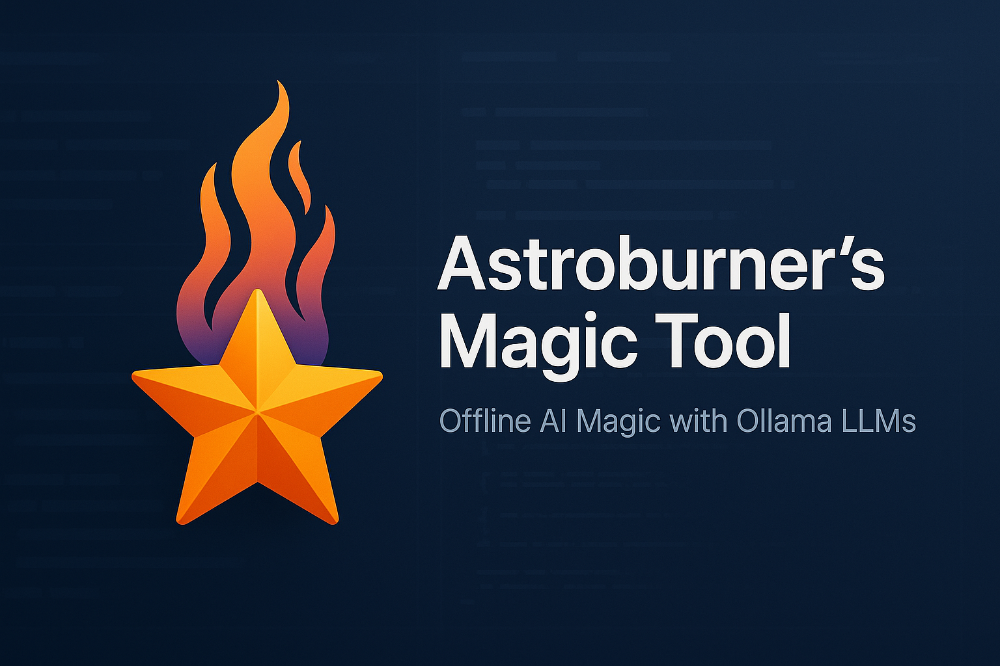
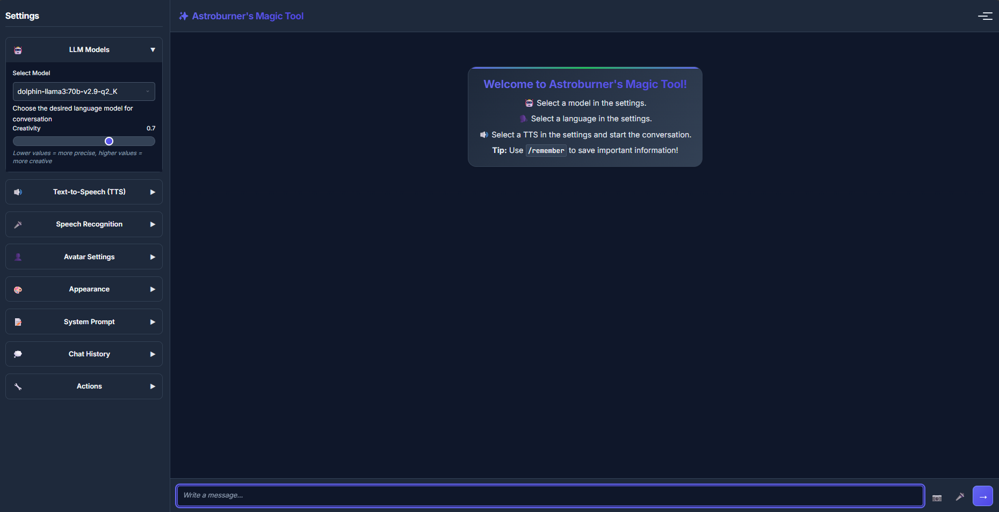
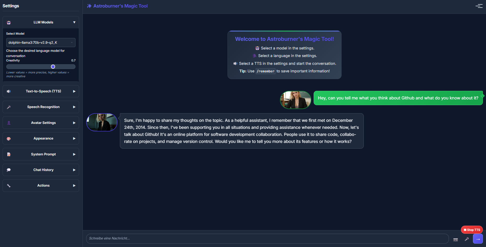

# 🚀 Magic LLM Multitool - Advanced Chat Interface

A modern, feature-rich web interface for Ollama with memory system, TTS, speech recognition, and multimodal support.



## ✨ Features

### 🤖 **AI Chat**
- **Multiple LLM Models** - Support for all Ollama models including vision and reasoning models
- **Real-time Chat** - Fast, responsive conversations  
- **Context Memory** - Maintains conversation history
- **Custom System Prompts** - Personalize AI behavior
- **Multimodal Support** - Vision models (LLaVA, llama3.2-vision) for image analysis
- **Reasoning Models** - Special support for reasoning LLMs with collapsible thinking process

### 🧠 **Long-term Memory System**
- **Smart Memory Commands** - `/remember`, `/memories`, natural language
- **Intelligent Processing** - AI formats and contextualizes memories
- **Persistent Storage** - JSON-based memory with timestamps
- **Natural Integration** - AI incorporates memories conversationally
- **Context-aware Responses** - Remembers important information across sessions

### 📁 **File Upload & Analysis**
- **Multiple File Types** - TXT, PDF, DOCX, CSV, XLSX, JSON, XML, and more
- **Intelligent Parsing** - Automatic content extraction from documents
- **File Preview** - Visual file management with size and type info
- **Drag & Drop Support** - Easy file uploading
- **Analysis Button** - Dedicated "Analyze Files" functionality

### 🔊 **Text-to-Speech (TTS)**
- **117+ Voices** - Microsoft Edge TTS integration
- **Multi-language Support** - German, English, French, Spanish, and more
- **Adjustable Speed & Pitch** - Customize voice output
- **Real-time Audio** - Instant speech synthesis
- **Smart TTS** - Only final answers are spoken (reasoning stays silent)

### 🎤 **Speech Recognition**
- **Voice Input** - Browser-based speech-to-text
- **Multi-language Recognition** - 8+ language support
- **Visual Feedback** - Live recording indicator
- **Auto-send** - Automatic message sending after recognition

### 🖼️ **Vision & Multimodal**
- **Image Upload** - Drag & drop or click to upload
- **Vision Models** - Support for LLaVA, llama3.2-vision, and other multimodal models
- **Image Preview** - See uploaded images before sending
- **Image Analysis** - AI can describe, analyze, and answer questions about images

### 🎨 **Modern UI/UX**
- **Dark/Light Mode** - Elegant theme switching
- **Responsive Design** - Works on desktop and mobile
- **Custom Avatars** - Personalize user and AI avatars
- **Collapsible Settings** - Clean, organized interface
- **Real-time Updates** - Live status indicators
- **Typing Indicators** - Shows when AI is processing
- **Reasoning Blocks** - Expandable thinking process for reasoning models

## 🛠️ Installation

### Prerequisites
- **Python 3.8+**
- **Ollama** installed and running
- **Modern web browser**

### 1. Clone Repository
```bash
git clone https://github.com/yourusername/ollama-ui.git
cd ollama-ui
```

### 2. Install Dependencies
```bash
cd backend
python -m venv venv

# Windows
venv\Scripts\activate
# macOS/Linux  
source venv/bin/activate

pip install -r requirements.txt
```

### 3. Start Ollama
```bash
ollama serve
ollama pull llama2  # or your preferred model
```

### 4. Start Backend
```bash
cd backend
python app.py
```

### 5. Open in Browser
Navigate to: `http://localhost:5000`

## 📁 Project Structure

```
ollama-ui/
├── backend/                 # Python Flask Backend
│   ├── app.py              # Main application
│   ├── config.py           # Configuration
│   ├── requirements.txt    # Dependencies
│   └── services/           # Backend services
│       ├── llm_service.py      # Ollama integration
│       ├── tts_service.py      # Text-to-Speech
│       ├── memory_service.py   # Memory management
│       └── memory_manager.py   # Memory logic
├── frontend/               # HTML/CSS/JavaScript
│   ├── index.html         # Main interface
│   ├── css/               # Stylesheets
│   ├── js/                # JavaScript modules
│   └── assets/            # Static files
└── data/                   # Data storage
    └── memories/              # Memory files
```

## 🚀 Usage

### Basic Chat
1. Select a model from the sidebar (including vision and reasoning models)
2. Type your message and press Enter
3. Enjoy AI responses with optional TTS

### Memory Commands
```bash
# Save memories
/remember I love chocolate cake
Merke dir: Mein Geburtstag ist am 15. März
Remember: My favorite color is blue

# Recall memories  
/memories
Was weißt du noch?
What do you remember?
```

### Vision & Multimodal
- **Image Upload**: Drag & drop or click camera icon
- **File Upload**: Click paperclip icon for documents
- **Vision Models**: Use llama3.2-vision or similar models
- **Analysis**: Click "Analyze Files" button for document processing

### Voice Features
- **Speech Input**: Click microphone button
- **TTS Output**: Enable in settings, choose voice
- **Multi-language**: Select recognition language

### Reasoning Models
- **Special Display**: Reasoning process shown in expandable blocks
- **Silent Reasoning**: Only final answers are spoken via TTS
- **Models**: phi4-reasoning, qwen2.5-coder, and other reasoning LLMs

## ⚙️ Configuration

### Backend Settings (`backend/config.py`)
```python
OLLAMA_BASE_URL = "http://localhost:11434"  # Ollama server
HOST = "127.0.0.1"                          # Server host
PORT = 5000                                 # Server port
DEFAULT_MODEL = "llama2"                    # Default LLM
DEFAULT_TTS_VOICE = "de-DE-KatjaNeural"     # Default voice
```

### Frontend Settings
- Accessible via sidebar settings
- Persistent browser storage
- Real-time updates

## 🔧 Development

### Adding New Features
1. **Backend**: Add routes in `app.py`
2. **Frontend**: Extend services in `js/services/`
3. **UI**: Update components in `js/ui/`
4. **Styles**: Modify CSS in `css/`

### API Endpoints
- `GET /api/models` - Available models
- `GET /api/voices` - TTS voices  
- `POST /api/chat` - Send message
- `POST /api/memory` - Save memory
- `GET /api/memories` - Get memories

## 🐛 Troubleshooting

### Common Issues

**Models not loading**
- Ensure Ollama is running: `ollama serve`
- Check Ollama URL in config: `http://localhost:11434`

**TTS not working**
- Check internet connection (Edge TTS requires online access)
- Try different voice in settings

**Vision models not seeing images**
- Ensure you're using a vision-capable model (llama3.2-vision, LLaVA)
- Check that images are properly uploaded before sending

**Reasoning not showing**
- Use reasoning-capable models (phi4-reasoning, qwen2.5-coder)
- Reasoning blocks appear automatically for supported responses

**File upload issues**
- Check file size (max 10MB per file)
- Supported formats: TXT, PDF, DOCX, CSV, XLSX, JSON, XML
- PDF parsing requires PyPDF2 installation

**Memory errors**
- Check file permissions in `data/memories/` folder
- Verify JSON syntax in memory files
- Reset memory file to `[]` if corrupted

**CORS errors**
- Restart backend server
- Check if Flask-CORS is installed

## 🤝 Contributing

1. Fork the repository
2. Create feature branch (`git checkout -b feature/amazing-feature`)
3. Commit changes (`git commit -m 'Add amazing feature'`)
4. Push to branch (`git push origin feature/amazing-feature`)
5. Open Pull Request

## 📜 License

This project is licensed under the MIT License - see the [LICENSE](LICENSE) file for details.

## 🙏 Acknowledgments

- **Ollama** - Local LLM runtime
- **Microsoft Edge TTS** - Text-to-Speech service
- **Flask** - Web framework
- **Inter Font** - Typography
- **JetBrains Mono** - Code font

## 🔮 Roadmap

- [ ] **Advanced PDF Processing** - Better text extraction and OCR support
- [ ] **Multi-user Support** - User sessions and authentication
- [ ] **Plugin System** - Extensible architecture for custom tools
- [ ] **RAG Integration** - Document embeddings and vector search
- [ ] **Voice Cloning** - Custom TTS voices
- [ ] **Mobile App** - React Native/Flutter companion
- [ ] **Docker Support** - Easy deployment and scaling
- [ ] **Cloud Integration** - Backup & sync across devices
- [ ] **Conversation Branching** - Multiple chat threads
- [ ] **Model Fine-tuning** - Custom model training interface
- [ ] **Advanced Memory** - Semantic search and auto-categorization
- [ ] **Collaboration** - Shared chats and team workspaces

## 📞 Support

- **Issues**: [GitHub Issues]
- **Discussions**: [GitHub Discussions]
- **Email**: via github

## 🖼️ UI-images



---

**⭐ Star this repo if you find it useful!**